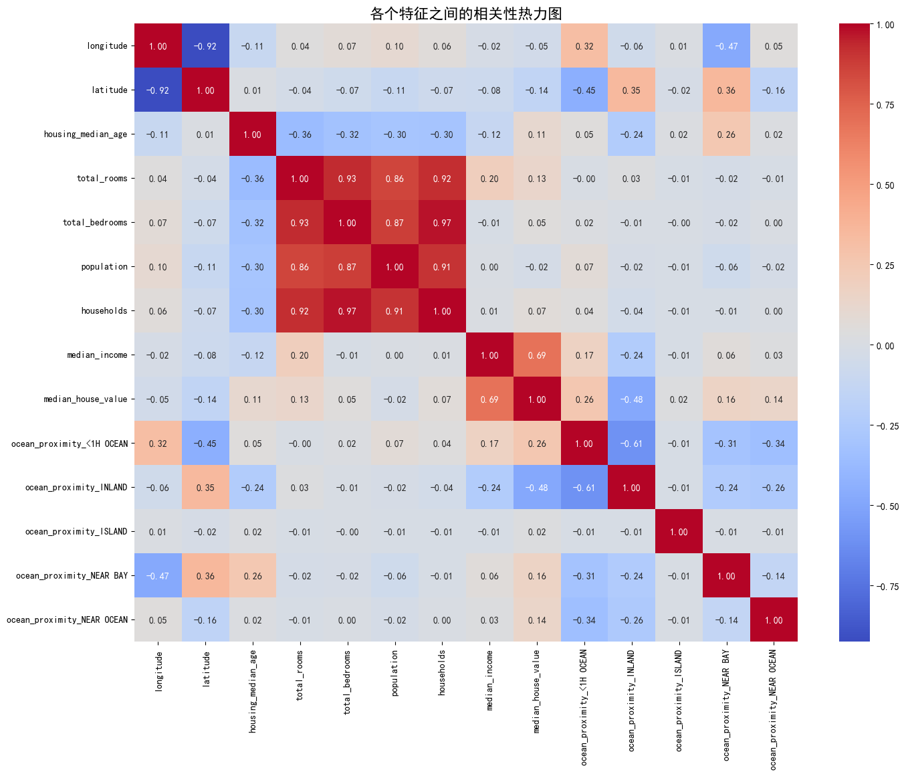
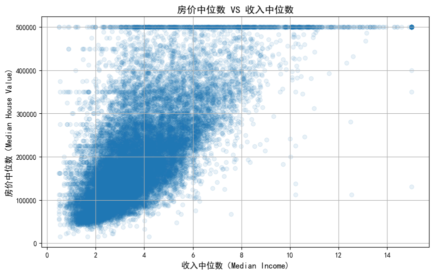
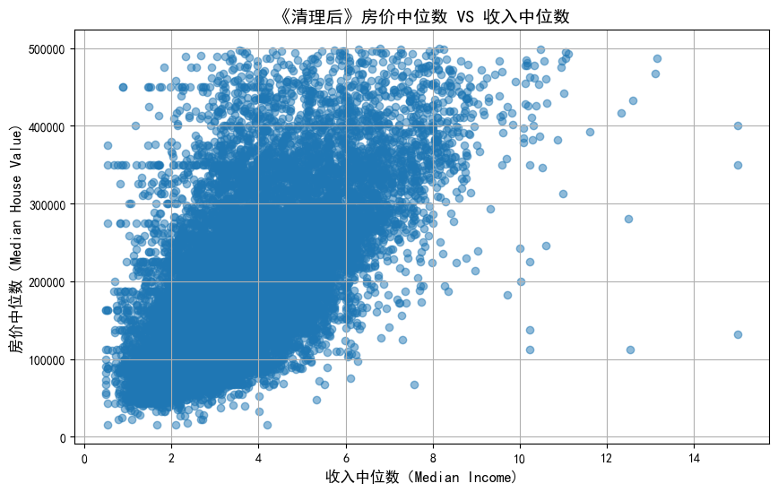

```python
import pandas as pd
file_path = r"C:\Users\Administrator\Documents\housing.csv"
housing_df = pd.read_csv(file_path)

print("数据显示前5行:")
print(housing_df.head())

print("\n\n数据集基本信息:")
housing_df.info()

```

    数据显示前5行:
       longitude  latitude  housing_median_age  total_rooms  total_bedrooms  \
    0    -122.23     37.88                41.0        880.0           129.0   
    1    -122.22     37.86                21.0       7099.0          1106.0   
    2    -122.24     37.85                52.0       1467.0           190.0   
    3    -122.25     37.85                52.0       1274.0           235.0   
    4    -122.25     37.85                52.0       1627.0           280.0   
    
       population  households  median_income  median_house_value ocean_proximity  
    0       322.0       126.0         8.3252            452600.0        NEAR BAY  
    1      2401.0      1138.0         8.3014            358500.0        NEAR BAY  
    2       496.0       177.0         7.2574            352100.0        NEAR BAY  
    3       558.0       219.0         5.6431            341300.0        NEAR BAY  
    4       565.0       259.0         3.8462            342200.0        NEAR BAY  
    
    
    数据集基本信息:
    <class 'pandas.core.frame.DataFrame'>
    RangeIndex: 20640 entries, 0 to 20639
    Data columns (total 10 columns):
     #   Column              Non-Null Count  Dtype  
    ---  ------              --------------  -----  
     0   longitude           20640 non-null  float64
     1   latitude            20640 non-null  float64
     2   housing_median_age  20640 non-null  float64
     3   total_rooms         20640 non-null  float64
     4   total_bedrooms      20433 non-null  float64
     5   population          20640 non-null  float64
     6   households          20640 non-null  float64
     7   median_income       20640 non-null  float64
     8   median_house_value  20640 non-null  float64
     9   ocean_proximity     20640 non-null  object 
    dtypes: float64(9), object(1)
    memory usage: 1.6+ MB
    


```python
median_bedrooms = housing_df['total_bedrooms'].median()
print(f"卧室数的中位数是:{median_bedrooms}")

```

    卧室数的中位数是:435.0
    


```python
housing_df['total_bedrooms'].fillna(median_bedrooms)
housing_df['total_bedrooms'] = housing_df['total_bedrooms'].fillna(median_bedrooms)
print("\n\n填充缺失值后的数据集信息:")
housing_df.info()
```

    
    
    填充缺失值后的数据集信息:
    <class 'pandas.core.frame.DataFrame'>
    RangeIndex: 20640 entries, 0 to 20639
    Data columns (total 10 columns):
     #   Column              Non-Null Count  Dtype  
    ---  ------              --------------  -----  
     0   longitude           20640 non-null  float64
     1   latitude            20640 non-null  float64
     2   housing_median_age  20640 non-null  float64
     3   total_rooms         20640 non-null  float64
     4   total_bedrooms      20640 non-null  float64
     5   population          20640 non-null  float64
     6   households          20640 non-null  float64
     7   median_income       20640 non-null  float64
     8   median_house_value  20640 non-null  float64
     9   ocean_proximity     20640 non-null  object 
    dtypes: float64(9), object(1)
    memory usage: 1.6+ MB
    


```python
print("咱们来看看'ocean_proximity'列里都有啥：")
print(housing_df['ocean_proximity'].value_counts())
```

    咱们来看看'ocean_proximity'列里都有啥：
    ocean_proximity
    <1H OCEAN     9136
    INLAND        6551
    NEAR OCEAN    2658
    NEAR BAY      2290
    ISLAND           5
    Name: count, dtype: int64
    


```python
housing_df_encoded = pd.get_dummies(housing_df,columns=['ocean_proximity'])
print("热度编码转换后的数据前5行:")
print(housing_df_encoded.head())
print("\n\n转换后的数据集基本信息：")
housing_df_encoded.info()                                                         
```

    热度编码转换后的数据前5行:
       longitude  latitude  housing_median_age  total_rooms  total_bedrooms  \
    0    -122.23     37.88                41.0        880.0           129.0   
    1    -122.22     37.86                21.0       7099.0          1106.0   
    2    -122.24     37.85                52.0       1467.0           190.0   
    3    -122.25     37.85                52.0       1274.0           235.0   
    4    -122.25     37.85                52.0       1627.0           280.0   
    
       population  households  median_income  median_house_value  \
    0       322.0       126.0         8.3252            452600.0   
    1      2401.0      1138.0         8.3014            358500.0   
    2       496.0       177.0         7.2574            352100.0   
    3       558.0       219.0         5.6431            341300.0   
    4       565.0       259.0         3.8462            342200.0   
    
       ocean_proximity_<1H OCEAN  ocean_proximity_INLAND  ocean_proximity_ISLAND  \
    0                      False                   False                   False   
    1                      False                   False                   False   
    2                      False                   False                   False   
    3                      False                   False                   False   
    4                      False                   False                   False   
    
       ocean_proximity_NEAR BAY  ocean_proximity_NEAR OCEAN  
    0                      True                       False  
    1                      True                       False  
    2                      True                       False  
    3                      True                       False  
    4                      True                       False  
    
    
    转换后的数据集基本信息：
    <class 'pandas.core.frame.DataFrame'>
    RangeIndex: 20640 entries, 0 to 20639
    Data columns (total 14 columns):
     #   Column                      Non-Null Count  Dtype  
    ---  ------                      --------------  -----  
     0   longitude                   20640 non-null  float64
     1   latitude                    20640 non-null  float64
     2   housing_median_age          20640 non-null  float64
     3   total_rooms                 20640 non-null  float64
     4   total_bedrooms              20640 non-null  float64
     5   population                  20640 non-null  float64
     6   households                  20640 non-null  float64
     7   median_income               20640 non-null  float64
     8   median_house_value          20640 non-null  float64
     9   ocean_proximity_<1H OCEAN   20640 non-null  bool   
     10  ocean_proximity_INLAND      20640 non-null  bool   
     11  ocean_proximity_ISLAND      20640 non-null  bool   
     12  ocean_proximity_NEAR BAY    20640 non-null  bool   
     13  ocean_proximity_NEAR OCEAN  20640 non-null  bool   
    dtypes: bool(5), float64(9)
    memory usage: 1.5 MB
    


```python
import matplotlib.pyplot as plt
import seaborn as sns
plt.rcParams['font.sans-serif'] = ['SimHei']
plt.rcParams['axes.unicode_minus'] = False
corr_matrix = housing_df_encoded.corr()
plt.figure(figsize=(16.,12))
sns.heatmap(corr_matrix,annot=True,cmap='coolwarm',fmt='.2f')
plt.title('各个特征之间的相关性热力图',fontsize=16)
plt.show()
print("\n\n与房价中位数（median_house_value)最相关的特征：")
print(corr_matrix['median_house_value'].sort_values(ascending=False))
            
```


    

    


    
    
    与房价中位数（median_house_value)最相关的特征：
    median_house_value            1.000000
    median_income                 0.688075
    ocean_proximity_<1H OCEAN     0.256617
    ocean_proximity_NEAR BAY      0.160284
    ocean_proximity_NEAR OCEAN    0.141862
    total_rooms                   0.134153
    housing_median_age            0.105623
    households                    0.065843
    total_bedrooms                0.049457
    ocean_proximity_ISLAND        0.023416
    population                   -0.024650
    longitude                    -0.045967
    latitude                     -0.144160
    ocean_proximity_INLAND       -0.484859
    Name: median_house_value, dtype: float64
    


```python
plt.figure(figsize=(10,6))
plt.scatter(x=housing_df_encoded['median_income'],y=housing_df_encoded['median_house_value'],alpha=0.1)
plt.title('房价中位数 VS 收入中位数',fontsize=14)
plt.xlabel('收入中位数（Median Income)',fontsize=12)
plt.ylabel('房价中位数（Median House Value)',fontsize=12)
plt.grid(True)
plt.show()
```


    

    


观测到这里出现了严重数据问题。我们的数据在500000被截断，这说明数据统计者为这个数据收集设定了上限，可能把高于500000的数据也统计成了500000.
所以这个数据集在数据收集端就出现了重大错误。所以我们有两套方案
方案1：问责数据统计者，让其提供高于50000的详细数据，保证我们的模型在整个价格区间都能学习到完整数据提高预测准确性。
方案2：删除500000上的所有数据，并限制模型预测区间，模型仅能对低于500000的数据进行预测
由于我们现在无法联系责任人，所以采用方案2         


```python
rows_before_cleaning = len(housing_df_encoded)
print(f"清理前，我们的数据集有{rows_before_cleaning}行。")
housing_df_cleaned = housing_df_encoded[housing_df_encoded['median_house_value']<500000].copy()
rows_after_cleaning = len(housing_df_cleaned)
print(f"清理后，我们的数据集剩下{rows_after_cleaning}行。")
print(f"成功移除{rows_before_cleaning-rows_after_cleaning}个'问题数据'")
plt.figure(figsize=(10,6))
plt.scatter(x=housing_df_cleaned['median_income'],y=housing_df_cleaned['median_house_value'],alpha=0.5)
plt.title('《清理后》房价中位数 VS 收入中位数',fontsize=14)
plt.xlabel('收入中位数（Median Income)',fontsize=12)
plt.ylabel('房价中位数（Median House Value)',fontsize=12)
plt.grid(True)
plt.show()
```

    清理前，我们的数据集有20640行。
    清理后，我们的数据集剩下19648行。
    成功移除992个'问题数据'
    


    

    


仅靠总量特征去判断房价具备误导性，总量特征仅能反应这个区域的规模有多大，不能直接反应居住品质，会导致后续建模让模型错误的以为一个区域户数越多，放假就越高而忽略了居住品质的影响。
所以提出三点猜
每户平均房间数量：这个指标越大意味着”可能“房屋面积更大，反映了房屋宽敞程度
每户平均人口：判断每户的住房拥挤情况，数字越少说明核心家庭多，数字越高说明可能会有更多合租情况，房价可能会降低。
卧室占总房间的比例：用这个数字判断户型结构的合理性，这个数字越小也许房屋的布局很科学功能性齐全，这个数字越高，可能意味着房屋格局有问题甚至是隔断房改造
因此建立三个基于原始数据的新特征进行分析


```python
housing_df_featured = housing_df_cleaned.copy()
housing_df_featured["rooms_per_household"]=housing_df_featured["total_rooms"]/housing_df_featured["households"]
housing_df_featured["population_per_household"] = housing_df_featured["population"]/housing_df_featured["households"]
housing_df_featured["bedrooms_per_room"]=housing_df_featured["total_bedrooms"]/housing_df_featured["total_rooms"]
corr_matrix_featured = housing_df_featured.corr()
print("新特征与房价相关性：\n")
print(corr_matrix_featured["median_house_value"].sort_values(ascending = False))
```

    新特征与房价相关性：
    
    median_house_value            1.000000
    median_income                 0.646719
    ocean_proximity_<1H OCEAN     0.287580
    ocean_proximity_NEAR BAY      0.155753
    total_rooms                   0.144988
    ocean_proximity_NEAR OCEAN    0.134291
    rooms_per_household           0.111581
    households                    0.095634
    total_bedrooms                0.074704
    housing_median_age            0.065139
    ocean_proximity_ISLAND        0.030951
    population                    0.013592
    population_per_household     -0.021205
    longitude                    -0.045733
    latitude                     -0.149257
    bedrooms_per_room            -0.199733
    ocean_proximity_INLAND       -0.499905
    Name: median_house_value, dtype: float64
    

卧室占比（bedrooms_per_room):-0.50 符合猜想，卧室占比越高可能是隔断改造的几率越高，因此房价可能越低，因此负相关
每户房间数（rooms_per_household):0.11 符合猜想，房间越多可能布局越科学功能性越齐全房价越高，因此正相关
每户人口数（population_per_household):-0.02,猜想方向正确但趋近于零，考虑忽略不计


```python
from sklearn.model_selection import train_test_split
x = housing_df_featured.drop("median_house_value",axis=1)
y = housing_df_featured["median_house_value"].copy()
x_train,x_test,y_train,y_test = train_test_split(x,y,test_size=0.2,random_state=42)
print("拆分完成！数据集被拆分成：\n")
print(f"训练集 (x_train) 有 {x_train.shape[0]} 行，{x_train.shape[1]} 个特征。")
print(f"测试集 (x_test) 有 {x_test.shape[0]} 行，{x_test.shape[1]} 个特征。")
print(f"训练目标 (y_train) 有 {y_train.shape[0]} 个值。")
print(f"测试目标 (y_test) 有 {y_test.shape[0]} 个值。")
print("\n训练集特征（x_train)前五行：")
x_train.head()
```

    拆分完成！数据集被拆分成：
    
    训练集 (x_train) 有 15718 行，16 个特征。
    测试集 (x_test) 有 3930 行，16 个特征。
    训练目标 (y_train) 有 15718 个值。
    测试目标 (y_test) 有 3930 个值。
    
    训练集特征（x_train)前五行：
    


<div>
<style scoped>
    .dataframe tbody tr th:only-of-type {
        vertical-align: middle;
    }

    .dataframe tbody tr th {
        vertical-align: top;
    }

    .dataframe thead th {
        text-align: right;
    }
</style>
<table border="1" class="dataframe">
  <thead>
    <tr style="text-align: right;">
      <th></th>
      <th>longitude</th>
      <th>latitude</th>
      <th>housing_median_age</th>
      <th>total_rooms</th>
      <th>total_bedrooms</th>
      <th>population</th>
      <th>households</th>
      <th>median_income</th>
      <th>ocean_proximity_&lt;1H OCEAN</th>
      <th>ocean_proximity_INLAND</th>
      <th>ocean_proximity_ISLAND</th>
      <th>ocean_proximity_NEAR BAY</th>
      <th>ocean_proximity_NEAR OCEAN</th>
      <th>rooms_per_household</th>
      <th>population_per_household</th>
      <th>bedrooms_per_room</th>
    </tr>
  </thead>
  <tbody>
    <tr>
      <th>12794</th>
      <td>-121.46</td>
      <td>38.64</td>
      <td>20.0</td>
      <td>1517.0</td>
      <td>323.0</td>
      <td>1287.0</td>
      <td>328.0</td>
      <td>1.6607</td>
      <td>False</td>
      <td>True</td>
      <td>False</td>
      <td>False</td>
      <td>False</td>
      <td>4.625000</td>
      <td>3.923780</td>
      <td>0.212920</td>
    </tr>
    <tr>
      <th>14570</th>
      <td>-117.21</td>
      <td>32.83</td>
      <td>35.0</td>
      <td>2259.0</td>
      <td>501.0</td>
      <td>1340.0</td>
      <td>511.0</td>
      <td>3.4482</td>
      <td>False</td>
      <td>False</td>
      <td>False</td>
      <td>False</td>
      <td>True</td>
      <td>4.420744</td>
      <td>2.622309</td>
      <td>0.221780</td>
    </tr>
    <tr>
      <th>9328</th>
      <td>-122.53</td>
      <td>37.96</td>
      <td>35.0</td>
      <td>908.0</td>
      <td>194.0</td>
      <td>413.0</td>
      <td>197.0</td>
      <td>3.9917</td>
      <td>False</td>
      <td>False</td>
      <td>False</td>
      <td>True</td>
      <td>False</td>
      <td>4.609137</td>
      <td>2.096447</td>
      <td>0.213656</td>
    </tr>
    <tr>
      <th>5102</th>
      <td>-118.31</td>
      <td>33.94</td>
      <td>41.0</td>
      <td>1353.0</td>
      <td>286.0</td>
      <td>751.0</td>
      <td>250.0</td>
      <td>2.7401</td>
      <td>True</td>
      <td>False</td>
      <td>False</td>
      <td>False</td>
      <td>False</td>
      <td>5.412000</td>
      <td>3.004000</td>
      <td>0.211382</td>
    </tr>
    <tr>
      <th>1822</th>
      <td>-122.29</td>
      <td>37.92</td>
      <td>32.0</td>
      <td>1736.0</td>
      <td>234.0</td>
      <td>602.0</td>
      <td>231.0</td>
      <td>6.5160</td>
      <td>False</td>
      <td>False</td>
      <td>False</td>
      <td>True</td>
      <td>False</td>
      <td>7.515152</td>
      <td>2.606061</td>
      <td>0.134793</td>
    </tr>
  </tbody>
</table>
</div>


```python
from sklearn.pipeline import Pipeline
from sklearn.preprocessing import StandardScaler
from sklearn.linear_model import LinearRegression
pipeline_lr = Pipeline([
    ('scaler',StandardScaler()),
    ('regressor',LinearRegression())
     ])
print("开始训练第一个模型：线性回归！")
pipeline_lr.fit(x_train,y_train)
print("训练完成！！")
```

    开始训练第一个模型：线性回归！
    训练完成！！
    


```python
from sklearn.metrics import mean_squared_error
import numpy as np
print("模型对训练集进行预测")
housing_predictions = pipeline_lr.predict(x_train)
print("预测完成")
mse = mean_squared_error(y_train,housing_predictions)
rmse = np.sqrt(mse)
print(f"\n第一个线性回归模型的训练集RMES是：${rmse:.2f}")
print("\n解读：意味着模型在训练上进行预测时，平均的预测误差大约是上面这个数值.")
```

    模型对训练集进行预测
    预测完成
    
    第一个线性回归模型的训练集RMES是：$59667.18
    
    解读：意味着模型在训练上进行预测时，平均的预测误差大约是上面这个数值.
    


```python
from sklearn.model_selection import cross_val_score
print("对线性回归模型进行10折交叉验证")
scores = cross_val_score(pipeline_lr,x_train,y_train,scoring = 'neg_mean_squared_error',cv=10)
print("交叉验证完成！！！")
rmse_scores = np.sqrt(-scores)
print(f"\n交叉验证的10次RMSE分数分别是: \n{rmse_scores}")
print(f"\n平均RMSE: ${rmse_scores.mean():,.2f}")
print(f"RMSE标准差: ${rmse_scores.std():,.2f}")
print("\n解读：")
print("“平均RMSE”是我们模型性能的一个更可靠、更公正的度量。")
print("“RMSE标准差”反映了模型性能的稳定性。这个值越小，说明我们的模型在不同数据上的表现越稳定。")

```

    对线性回归模型进行10折交叉验证
    交叉验证完成！！！
    
    交叉验证的10次RMSE分数分别是: 
    [61795.2887853  63601.27496355 62667.80107308 59728.79841306
     60294.99956459 57813.30803681 57145.79447577 57547.13153652
     57956.35840995 61006.37655706]
    
    平均RMSE: $59,955.71
    RMSE标准差: $2,181.38
    
    解读：
    “平均RMSE”是我们模型性能的一个更可靠、更公正的度量。
    “RMSE标准差”反映了模型性能的稳定性。这个值越小，说明我们的模型在不同数据上的表现越稳定。
    


```python
from sklearn.tree import DecisionTreeRegressor
from sklearn.pipeline import Pipeline
from sklearn.preprocessing import StandardScaler
from sklearn.model_selection import cross_val_score
import numpy as np
pipeline_tree = Pipeline([
    ('scaler',StandardScaler()),
    ('regressor',DecisionTreeRegressor(random_state=42))])
print("开始对决策树模型进行10次折交叉验证")
tree_scores = cross_val_score(pipeline_tree,x_train,y_train,scoring="neg_mean_squared_error",cv=10)
print("交叉验证完成！！！")
tree_rmse_scores = np.sqrt(-tree_scores)
print(f"\n决策树模型的10次交叉验证RMSE分数分别是：\n{tree_rmse_scores}")
print(f"\n平均RMSE：${tree_rmse_scores.mean(): .2f}")
print(f"RMSE标准差：${tree_rmse_scores.std(): .2f}")
```

    开始对决策树模型进行10次折交叉验证
    交叉验证完成！！！
    
    决策树模型的10次交叉验证RMSE分数分别是：
    [65526.66019694 63445.523957   66291.6413853  63851.93686152
     66623.31494415 63117.29569038 59243.92728244 61498.6420825
     63848.00926979 63345.24077594]
    
    平均RMSE：$ 63679.22
    RMSE标准差：$ 2094.58
    


```python
from sklearn.ensemble import RandomForestRegressor
from sklearn.pipeline import Pipeline
from sklearn.preprocessing import StandardScaler
from sklearn.model_selection import cross_val_score
import numpy as np
pipeline_forest = Pipeline([
    ('scaler',StandardScaler()),
    ('regressor',RandomForestRegressor(n_estimators=100,random_state=42))])
print("开始对随机森林模型进行10折交叉验证")
forest_scores= cross_val_score(pipeline_forest,x_train,y_train,
                               scoring= "neg_mean_squared_error",cv=10)
print("交叉验证完成！！！！")
forest_rmse_scores=np.sqrt(-forest_scores)
print(f"\n随机森林模型的10次交叉验证RMSE分数分别是：\n{forest_rmse_scores}")
print(f"\n平均RMSE：${forest_rmse_scores.mean(): .2f}")
print(f"RMSE标准差：${forest_rmse_scores.std(): .2f}")
```

    开始对随机森林模型进行10折交叉验证
    交叉验证完成！！！！
    
    随机森林模型的10次交叉验证RMSE分数分别是：
    [45615.96113268 46512.81680786 47061.19293242 45306.64144583
     45148.37495137 43605.55248055 42202.02631209 43416.83481513
     44026.16495547 44505.82292594]
    
    平均RMSE：$ 44740.14
    RMSE标准差：$ 1408.17
    


```python
from sklearn.model_selection import GridSearchCV
from sklearn.ensemble import RandomForestRegressor
import numpy as np
param_grid = [
    {'n_estimators':[100,150],'max_features':[8,12]},
    {'bootstrap':[False],'n_estimators':[100],'max_features':[8]}]
forest_reg = RandomForestRegressor(random_state=42)
grid_search = GridSearchCV(forest_reg,param_grid,cv=5,
                           scoring='neg_mean_squared_error',
                           return_train_score=True)
print("开始进行网络搜索调优")
from sklearn.preprocessing import StandardScaler
scaler = StandardScaler()
x_train_scaled = scaler.fit_transform(x_train)
grid_search.fit(x_train_scaled,y_train)
print("网络搜索完成！！！！！")
print("\n已找到最优超参数组合")
print(grid_search.best_params_)
final_rmse = np.sqrt(-grid_search.best_score_)
print(f"\n使用最优超参数，交叉验证的平均RMSE为：${final_rmse: .2f}")
```

    开始进行网络搜索调优
    网络搜索完成！！！！！
    
    已找到最优超参数组合
    {'bootstrap': False, 'max_features': 8, 'n_estimators': 100}
    
    使用最优超参数，交叉验证的平均RMSE为：$ 43916.98
    


```python
import numpy as np
import pandas as pd
final_model = grid_search.best_estimator_
x_test_scaled = scaler.transform(x_test)
final_predictions = final_model.predict(x_test_scaled)
from sklearn.metrics import mean_squared_error
final_mse = mean_squared_error(y_test,final_predictions)
final_rmse = np.sqrt(final_mse)
print(f"---最终模型评估报告---")
print(f"最终模型RMSE（在测试集上）是：${final_rmse: .2f}")
print("--------------------------------")

print("在模型中特征重要性排名如下:")
feature_importances = final_model.feature_importances_
feature_names = x_train.columns
importance_df = pd.DataFrame({
    'Feature':feature_names,
    'Importance':feature_importances
}).sort_values(by='Importance',ascending=False)
print(importance_df)
print("\n解读：这个列表告诉我们，哪些因素对房价的预测贡献度最大！")
      
      
```

    ---最终模型评估报告---
    最终模型RMSE（在测试集上）是：$ 44995.27
    --------------------------------
    在模型中特征重要性排名如下:
                           Feature  Importance
    7                median_income    0.335914
    9       ocean_proximity_INLAND    0.171843
    14    population_per_household    0.106643
    0                    longitude    0.088667
    1                     latitude    0.078096
    15           bedrooms_per_room    0.051279
    13         rooms_per_household    0.043555
    2           housing_median_age    0.039042
    3                  total_rooms    0.016969
    5                   population    0.016269
    4               total_bedrooms    0.015714
    6                   households    0.015213
    8    ocean_proximity_<1H OCEAN    0.012914
    12  ocean_proximity_NEAR OCEAN    0.004681
    11    ocean_proximity_NEAR BAY    0.002861
    10      ocean_proximity_ISLAND    0.000340
    
    解读：这个列表告诉我们，哪些因素对房价的预测贡献度最大！
    


```python

```
